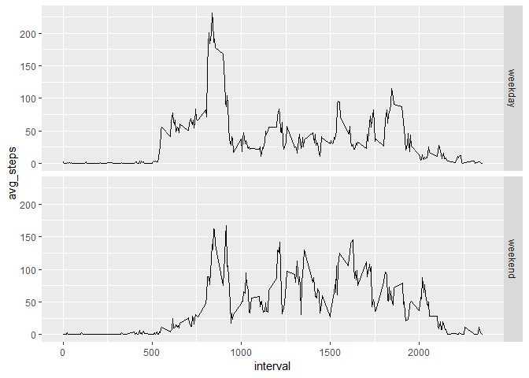

## Loading and preprocessing the data

```r
unzip(zipfile = "activity.zip")
data <- read.csv("activity.csv")
```


## What is mean total number of steps taken per day?
#### Histogram of the total number of steps taken each day

```r
library(tidyr)
library(dplyr)
library(ggplot2)
total_steps_per_day <- data.frame(data %>% group_by(date) %>% summarise(total_steps_per_day = sum(steps)))
hist(total_steps_per_day$total_steps_per_day, main = "Total Number of Steps", xlab = "Total Steps")
```

<!-- -->

#### Report mean and median total number of steps taken per day

```r
mean_steps <- mean(total_steps_per_day$total_steps_per_day, na.rm=TRUE)
print(mean_steps)
```

```
## [1] 10766.19
```

```r
median_steps <- median(total_steps_per_day$total_steps_per_day, na.rm=TRUE)
print(median_steps)
```

```
## [1] 10765
```


## What is the average daily activity pattern?
#### Plot the time series of the 5-min interval (x-axis) and the average number of steps taken, averaged across all days (y-axis)

```r
avg_steps_per_interval <- data.frame(data %>% group_by(interval) %>% summarise(avg_steps = mean(steps, na.rm=TRUE)))
# png("plot1.png")
plot(avg_steps_per_interval$avg_steps, type="l", xlab="Interval", ylab="Number of Steps")
```

<!-- -->

```r
# dev.off()
```

#### Which 5-minute interval, on average across all the days in the dataset, contains the maximum number of steps?

```r
this_one <- avg_steps_per_interval[avg_steps_per_interval$avg_steps == max(avg_steps_per_interval$avg_steps),]
print(this_one$interval)
```

```
## [1] 835
```


## Imputing missing values

#### Calculate the total number of missing values in the dataset

```r
print(sum(is.na(data$steps)))
```

```
## [1] 2304
```

#### Devise a strategy for filling in all of the missing values in the dataset

```r
new_data <- data
for (i in 1:nrow(new_data)) {
  if (is.na(new_data[i,"steps"])) {
    interval <- new_data[i, "interval"]
    new_data[i,"steps"] <- avg_steps_per_interval[avg_steps_per_interval$interval == interval,"avg_steps"]
  } 
}
```

#### Create a new dataset with missing data fileed in

```r
print(sum(is.na(new_data$steps)))
```

```
## [1] 0
```

#### Histogram and mean and median total number of steps taken per day

```r
total_steps_per_day <- data.frame(new_data %>% group_by(date) %>% summarise(total_steps_per_day = sum(steps)))
# png("plot2.png")
hist(total_steps_per_day$total_steps_per_day, main = "Total Number of Steps (missing values imputed)", xlab = "Total Steps")
```

<!-- -->

```r
# dev.off()

mean_steps <- mean(total_steps_per_day$total_steps_per_day, na.rm=TRUE)
print(mean_steps)
```

```
## [1] 10766.19
```

```r
median_steps <- median(total_steps_per_day$total_steps_per_day, na.rm=TRUE)
print(median_steps)
```

```
## [1] 10766.19
```

## Are there differences in activity patterns between weekdays and weekends?

#### Create a new factor variable with two levels, "weekday" and "weekend"

```r
new_data$weekday <- weekdays(as.Date(new_data$date, format = "%Y-%m-%d"))
new_data$weekday_type <- factor(ifelse(new_data$weekday == "Saturday" | new_data$weekday == "Sunday", "weekend", "weekday"), levels=c("weekday", "weekend"))
```

#### Panel plot containing a time series plot of 5-min interval(x-axis) and the average number of steps taken, averaged across all weekday days or weekend days (y-axis).

```r
new_avg_steps_per_interval <- data.frame(new_data %>% group_by(interval, weekday_type) %>% summarise(avg_steps = mean(steps, na.rm=TRUE)))
# png("plot3.png")
ggplot(new_avg_steps_per_interval,aes(interval, avg_steps)) + geom_line() + facet_grid(weekday_type ~ .)
```

<!-- -->

```r
# dev.off()
```


